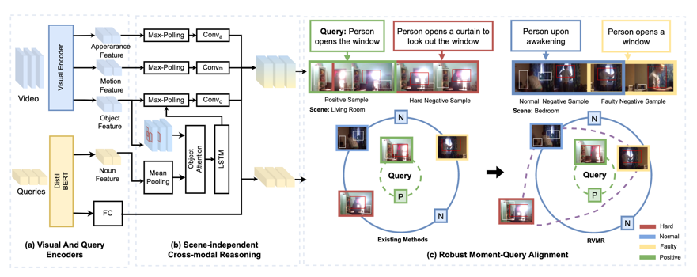

# Generalizing to Unseen Scenes: Query-centric Alignment Learning for Video Moment Retrieval

## Abstract
In this paper, we focus on diversifying the video moment retrieval (VMR) model into more scenes.
Most existing video moment retrieval methods focus on aligning video moments and queries by capturing the cross-modal relationship, which largely ignores the cross-instance relationship behind the representation learning.
Thus, they may easily get trouble into the inaccurate cross-instance contrastive relationship in the training process:
Existing methods perform unsatisfactorily in locating the queries with subtle differences. They neglect to mine the hard negative samples that belong to similar scenes but with different semantic content.
In this paper, we propose a novel robust video moment retrieval method that prevents the model from over-fitting the query-irrelevant scene features by accurately capturing both the cross-modal and cross-instance relationships.
Specifically, we first develop a scene-independent cross-modal reasoning module that filters out the redundant scene contents and infers the video semantics under the guidance of query information. 
Then, the faulty and hard negative samples are mined from the negative ones and calibrated for their contribution to the overall loss in contrastive learning. 
We validate our contributions through extensive experiments on cross-scene video moment retrieval settings, where the training and test data are from different scenes.
Experimental results show that the proposed robust video moment retrieval model can effectively retrieve target videos by capturing the real cross-modal and cross-instance relationships.

